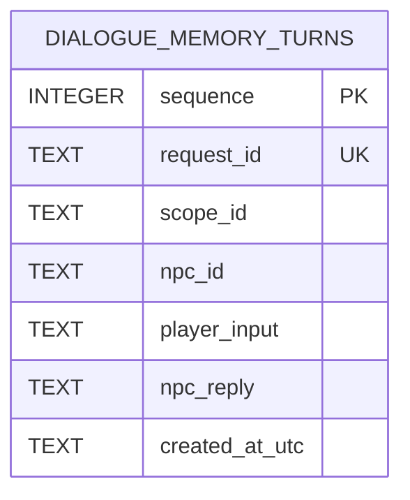

# Database Design

## 文档职责

本文档是 Python Service 本地 SQLite 数据库结构、约束、索引、事务和生命周期的唯一设计说明。UE/Python 通信字段以 [Protocol.md](./Protocol.md) 为准，Memory 模块边界以 [Architecture.md](../Planning/Architecture.md) 和 [PythonModules.md](./PythonModules.md) 为准。

当前数据库只保存显式启用 Memory 后成功完成的对话轮次。它不保存 UE 世界状态、NPC 人格、Provider 原始响应、模型推理过程或 Token 用量。

## 存储位置

默认数据库文件：

```text
PythonService/data/zl_memory.sqlite3
```

- 默认路径由 `PythonService/app/core/settings.py` 中的 `DEFAULT_MEMORY_DATABASE_PATH` 确定。
- 可通过进程环境变量 `ZL_MEMORY_DATABASE_PATH` 覆盖；相对路径按 Python Service 启动进程的工作目录解释。
- Repository 在初始化连接前自动创建父目录和数据库文件，不需要单独安装 SQLite 服务。
- WAL 模式运行期间，数据库旁可能出现 `zl_memory.sqlite3-wal` 和 `zl_memory.sqlite3-shm`。
- 数据库、WAL、SHM、journal 和备份文件均由 `.gitignore` 排除，不得提交到 Git。

测试使用独立临时数据库，不读写默认运行库。

## 所有权与生命周期

```text
FastAPI application lifespan
    -> SQLiteDialogueMemoryRepository.initialize()
        -> 创建父目录
        -> 打开连接
        -> 校验并初始化 Schema v1
    -> DialogueMemoryService 通过 Repository 接口读写
    -> SQLiteDialogueMemoryRepository.close()
```

- `app.memory.sqlite_repository.SQLiteDialogueMemoryRepository` 独占连接、Schema、SQL、事务和数据库行映射。
- `DialogueMemoryService` 只使用 Repository 抽象，不执行 SQL。
- Route、Context Builder、Provider 和 UE 均不直接访问数据库。
- 应用启动时初始化一个 Repository，应用关闭时关闭连接。
- `RLock` 串行保护同一进程内的连接操作；当前设计面向单机 Demo，不是多节点数据库方案。

## Schema 版本

当前 Schema 版本为 `1`，保存在 SQLite 内建的 `PRAGMA user_version` 中，不额外创建版本表。

初始化规则：

1. `user_version = 0`：创建当前表和索引，然后设置为 `1`。
2. `user_version = 1`：幂等确认当前表和索引存在，不删除已有数据。
3. 其他版本：拒绝启动并返回脱敏的 Repository 初始化错误；当前没有自动升级或降级迁移。

## 数据模型

当前只有一张业务表：`dialogue_memory_turns`。一个记录代表一次已经完整成功的“玩家输入 → NPC 回复”对话轮次。



### `dialogue_memory_turns`

```sql
CREATE TABLE IF NOT EXISTS dialogue_memory_turns (
    sequence INTEGER PRIMARY KEY AUTOINCREMENT,
    request_id TEXT NOT NULL UNIQUE CHECK(length(request_id) > 0),
    scope_id TEXT NOT NULL CHECK(length(scope_id) > 0),
    npc_id TEXT NOT NULL CHECK(length(npc_id) > 0),
    player_input TEXT NOT NULL CHECK(length(player_input) > 0),
    npc_reply TEXT NOT NULL CHECK(length(npc_reply) > 0),
    created_at_utc TEXT NOT NULL DEFAULT (
        strftime('%Y-%m-%dT%H:%M:%fZ', 'now')
    )
);
```

| 字段 | SQLite 类型 | 约束 | 用途 |
| --- | --- | --- | --- |
| `sequence` | `INTEGER` | 主键、`AUTOINCREMENT` | 数据库内稳定递增顺序；检索排序以它为准 |
| `request_id` | `TEXT` | 非空、全局唯一、长度大于 0 | 保证同一请求不会产生重复 Memory 轮次 |
| `scope_id` | `TEXT` | 非空、长度大于 0 | 不透明 Memory 隔离标识；与 `npc_id` 共同构成读取分区 |
| `npc_id` | `TEXT` | 非空、长度大于 0 | NPC 稳定业务标识；与 `scope_id` 共同构成读取分区 |
| `player_input` | `TEXT` | 非空、长度大于 0 | 本轮玩家输入明文 |
| `npc_reply` | `TEXT` | 非空、长度大于 0 | 本轮合法 NPC 回复明文 |
| `created_at_utc` | `TEXT` | 非空、数据库默认值 | SQLite 生成的 UTC 写入时间；当前不参与排序、检索或协议返回 |

协议层和 Service 层负责完整的类型、空白及长度校验；数据库 `CHECK` 约束是最后一道非空保护，不替代上层协议校验。

## 索引与隔离

```sql
CREATE INDEX IF NOT EXISTS idx_dialogue_memory_scope_npc_sequence
ON dialogue_memory_turns (scope_id, npc_id, sequence DESC);
```

该索引服务于唯一的历史读取模式：按精确 `(scope_id, npc_id)` 隔离，优先定位最新轮次。

- `scope_id` 相同但 `npc_id` 不同：不能互相读取。
- `npc_id` 相同但 `scope_id` 不同：不能互相读取。
- `request_id` 使用全表唯一约束，而不是分区内唯一约束。
- `scope_id` 和 `npc_id` 始终作为绑定参数传入 SQL，不参与表名或 SQL 字符串拼接。

## 读写语义

### 最近历史读取

读取时先在目标分区内按 `sequence DESC` 取最近 `limit` 个完整轮次，再按 `sequence ASC` 返回给 Memory Service。因此数据库高效选择最新窗口，上层收到的仍是最旧到最新的对话顺序。

`limit` 来自 `ZL_MEMORY_MAX_TURNS`，默认 `4`，合法范围为 `1` 至 `16`。读取结果不包含 `created_at_utc`，也不以时间戳排序。

### 完整轮次写入

只有同时满足以下条件时才写入：

1. 请求显式提供合法 `memory.scope_id`。
2. Provider 调用成功。
3. Provider 返回合法的非空回复。

Repository 使用 `BEGIN IMMEDIATE` 开始事务，把玩家输入和 NPC 回复作为同一行写入后提交。发生 SQLite 错误时回滚，因此不会留下只有玩家输入或只有 NPC 回复的“半轮”。

插入使用 `ON CONFLICT(request_id) DO NOTHING`。重复 `request_id` 返回 `DUPLICATE_REQUEST`，视为幂等结果，不会增加第二条记录。

### 统计与清理

本机维护入口支持：

- 聚合统计：返回轮次数、不同 scope 数、不同 scope/NPC 分区数。
- 精确清理：只删除给定 `(scope_id, npc_id)` 分区，使用事务提交或回滚。

维护入口不输出数据库路径、标识符或对话正文，也不暴露为 HTTP API。具体命令见 [Python Service README](../../PythonService/README.md#memory-维护)。

## 连接与事务设置

| 设置 | 当前值 | 目的 |
| --- | --- | --- |
| `isolation_level` | `None` | Repository 显式控制事务边界 |
| `check_same_thread` | `False` | 允许应用线程使用同一连接，由 Repository 锁保护 |
| `PRAGMA foreign_keys` | `ON` | 为后续关系约束保持安全默认值；当前表没有外键 |
| `PRAGMA busy_timeout` | `5000` 毫秒 | 短暂锁竞争时等待，而不是立即失败 |
| `PRAGMA journal_mode` | `WAL` | 支持本地持久化和更好的读写并发特性 |
| `PRAGMA synchronous` | `NORMAL` | 在 WAL 模式下平衡本地 Demo 的持久性与性能 |

Schema 初始化、写入和精确清理使用 `BEGIN IMMEDIATE`。读取和聚合统计不显式开启写事务。

## 失败与安全边界

- 初始化、读取、写入、统计、清理或关闭发生 SQLite/OSError 时，Repository 抛出不包含路径、SQL 和对话正文的 `MemoryRepositoryError`。
- Runtime 请求中的数据库失败映射为 `500 internal_error`，不向 UE 暴露内部结构。
- 数据库保存对话明文，当前仅适合受控本地 Demo；尚未实现生产级静态加密、访问控制、备份恢复和合规删除。
- 数据库文件不是 UE/Python HTTP 协议的一部分；不得在成功响应、错误响应或普通日志中返回路径、行 ID、Schema 版本或统计数据。

## 未持久化的数据

当前明确不保存：

- NPC 人格、目标和说话风格。
- 世界位置、局势和事实快照。
- 客户端传入的完整瞬时 `dialogue_history`。
- Provider 名称、模型名、原始响应、SDK 对象和 Token 用量。
- Prompt、系统约束、推理过程、Tool Call 或 Gameplay 状态。
- 玩家账号、存档内容、平台身份或认证凭据。

## 实现映射

| 设计职责 | 实现位置 |
| --- | --- |
| 路径和检索预算配置 | `PythonService/app/core/settings.py` |
| Schema、索引、SQL、连接和事务 | `PythonService/app/memory/sqlite_repository.py` |
| Repository 抽象和脱敏异常 | `PythonService/app/memory/base.py` |
| 持久化输入、输出和统计内部类型 | `PythonService/app/memory/models.py` |
| 隔离复核、预算和历史合并 | `PythonService/app/services/memory_service.py` |
| 应用启动与关闭生命周期 | `PythonService/app/main.py` |
| 本机统计和精确清理 | `PythonService/app/memory/maintenance.py` |
| Schema 与行为测试 | `PythonService/tests/test_sqlite_repository.py` |
